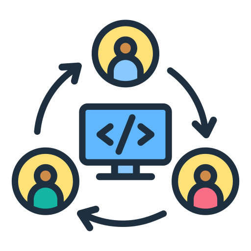

# Codepadi - Multi-Channel Protocol Agent for VS Code



Codepadi is a VS Code extension that enables seamless communication with remote servers using multiple protocols, including WebSocket, HTTP/REST, and gRPC. It provides a unified interface for managing server connections, executing commands, and monitoring responses.

## Features

- **Multi-Protocol Support**: Connect to servers using WebSocket, HTTP/REST, or gRPC
- **Connection Management**: Add, test, connect to, and remove server connections
- **Command Execution**: Send commands to connected servers and view responses
- **Automatic Reconnection**: Automatically reconnect to WebSocket servers when connections drop
- **Comprehensive Logging**: Detailed logging with configurable log levels
- **User-Friendly Interface**: Simple UI for managing server connections

## Installation

You can install this extension from the VS Code Marketplace:

1. Open VS Code
2. Go to Extensions (Ctrl+Shift+X)
3. Search for "Codepadi"
4. Click Install

Alternatively, download the `.vsix` file from the [releases page](https://github.com/codepadi/codepadi-vscode/releases) and install it manually:

```bash
code --install-extension codepadi-1.0.0.vsix
```

## Usage

### Adding a Server

1. Click on the Codepadi icon in the Activity Bar
2. Click the "+" icon to add a server
3. Enter server details:
   - Name: A friendly name for your server
   - Protocol: Select WebSocket, HTTP, or gRPC
   - URL: The server URL (e.g., `ws://localhost:8080` for WebSocket)
   - Auth Token: Optional authentication token

### Testing Connection

1. Right-click on a server in the MCP Servers view
2. Select "Test Server Connection"
3. Check the notification for connection test results

### Connecting to a Server

1. Click the plug icon next to your server
2. The server will show as connected when successful

### Executing Commands

1. Right-click on a connected server
2. Select "Execute Command"
3. Enter a command to execute on the server
4. View the response in the output panel

### Viewing Logs

1. Click the output icon in the MCP Servers view title
2. Review the logs in the output panel

## Configuration

You can configure Codepadi through VS Code settings:

```json
{
  "codepadi.logLevel": "info",
  "codepadi.reconnectAttempts": 5,
  "codepadi.reconnectInterval": 3000,
  "codepadi.connectionTimeout": 10000
}
```

- **logLevel**: Set to "error", "warn", "info", or "debug"
- **reconnectAttempts**: Number of reconnection attempts for WebSocket connections
- **reconnectInterval**: Interval between reconnection attempts (in milliseconds)
- **connectionTimeout**: Connection timeout in milliseconds

## Troubleshooting

### WebSocket Connection Issues

If you see "Unexpected server response: 200":

1. Verify your server is running and accepting WebSocket connections
2. Check if the URL is correct (should start with ws:// or wss://)
3. Make sure your server supports WebSocket protocol upgrades

### HTTP Connection Issues

1. Verify your server is running and accessible
2. Check if authentication is required
3. Ensure the endpoint supports the methods you're using

### gRPC Connection Issues

1. Verify your server is running and accessible
2. Check if the proto definitions match your server implementation
3. Ensure ports are open and accessible

## Development

To build and run this extension locally:

1. Clone the repository
2. Install dependencies: `npm install`
3. Compile the extension: `npm run compile`
4. Launch with VS Code: Press F5 or run `code --extensionDevelopmentPath=/path/to/codepadi`

## Contributing

Contributions are welcome! Please feel free to submit a Pull Request.

1. Fork the repository
2. Create your feature branch: `git checkout -b feature/amazing-feature`
3. Commit your changes: `git commit -m 'Add some amazing feature'`
4. Push to the branch: `git push origin feature/amazing-feature`
5. Open a Pull Request

## License

This project is licensed under the ISC License - see the LICENSE file for details.

## Acknowledgements

- [VS Code Extension API](https://code.visualstudio.com/api)
- [reconnecting-websocket](https://github.com/pladaria/reconnecting-websocket)
- [winston](https://github.com/winstonjs/winston)
- [gRPC](https://grpc.io/)

---

Made with ❤️ by the Codepadi Team
